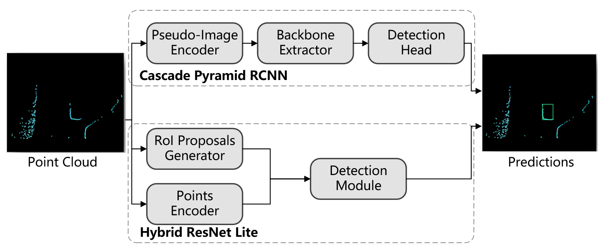
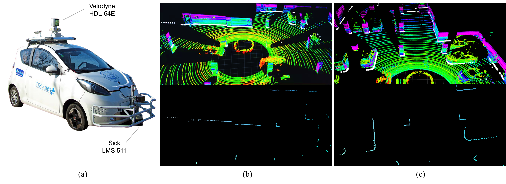
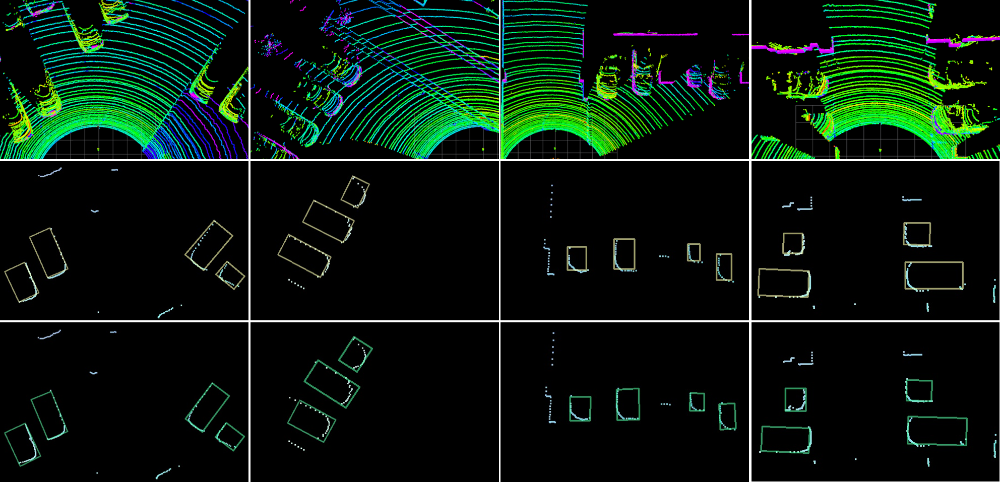

## Pseudo-Image and Sparse Points: Vehicle Detection with 2D LiDAR Revisited by Deep Learning Based Methods

This repository is the implementation and the related datasets of our paper `Pseudo-Image and Sparse Points: Vehicle Detection with 2D LiDAR Revisited by Deep Learning Based Methods`. If you benefit from this repository, please cite our paper.

```
@ARTICLE{,
        title = {Pseudo-Image and Sparse Points: Vehicle Detection with 2D LiDAR Revisited by Deep Learning Based Methods},
      journal = {IEEE TRANSACTIONS ON INTELLIGENT TRANSPORTATION SYSTEMS},
         year = {2020},
        pages = {},
      author  = {Guang, Chen and Fa, Wang and Sanqing, Qu and Kai, Chen and Junwei, Yu and Xiangyong, Liu and Lu, Xiong and Alois, Knoll}, 
       eprint = {} 
}
```

### Abstract

Detecting and locating surrounding vehicles robustly and efficiently are essential capabilities for autonomous vehicles. Existing solutions often rely on vision-based methods or 3D LiDAR-based methods. These methods are either too expensive in both sensor pricing (3D LiDAR) and computation (camera and 3D LiDAR) or less robust in resisting harsh environment changes (camera). In this work, we revisit the LiDAR based approaches for vehicle detection with a less expensive 2D LiDAR by utilizing modern deep learning approaches. We aim at filling in the gap as few previous works conclude an efficient and robust vehicle detection solution in a deep learning way in 2D. To this end, we propose a learning based method with the input of pseudo-images, named Cascade Pyramid Region Proposal Convolution Neural Network (Cascade Pyramid RCNN), and a hybrid learning method with the input of sparse points, named Hybrid Resnet Lite. Experiments are conducted with our newly 2D LiDAR vehicle dataset recorded in complex traffic environments. Results demonstrate that the Cascade Pyramid RCNN outperforms state-of-the-art methods in accuracy while the proposed Hybrid Resnet Lite provides superior performance of the speed and lightweight model by hybridizing learning based and non-learning based modules. As few previous works conclude an efficient and robust vehicle detection solution with 2D LiDAR, our research fills in this gap and illustrates that even with limited sensing source from a 2D LiDAR, detecting obstacles like vehicles efficiently and robustly is still achievable.



### Dataset

#### Our data collecting platform

Our data collecting platform is a refitted electric vehicle that is capable of fully autonomous driving named Tongji intelligent EV. i.e TiEV. TiEV is equipped with several types of sensors. Among these, a Sick LMS511 2D laser scanner is installed to cover the front blind spot left by a multi-beam HDL64 on the cars top. A differential global positioning system (DGPS) and an inertial measurement unit (IMU) system which consist of Novatel simpak6 receiver and Oxts RT2000 GNSS provide accurate ego-motion and global localization. All sensors have been carefully calibrated and systemically integrated.



#### Data Release

you can get our data at Baiduyun Cloud URL: https://pan.baidu.com/s/1nYYVnSxpRYbd9iFPTO7kog  Keywords: 4fa0

### Qualitative Detection Result



### Usage

You can access the [`Hybrid Resnet Lite` README.md](./src/Hybrid ResNet Lite) and [`Cascade Pyramid RCNN` README.md](./src/Cascade Pyramid RCNN) to get details.

### Contact 
Please contact Guang Chen (email:tj_autodrive@hotmail.com) for your questions about this repository.
